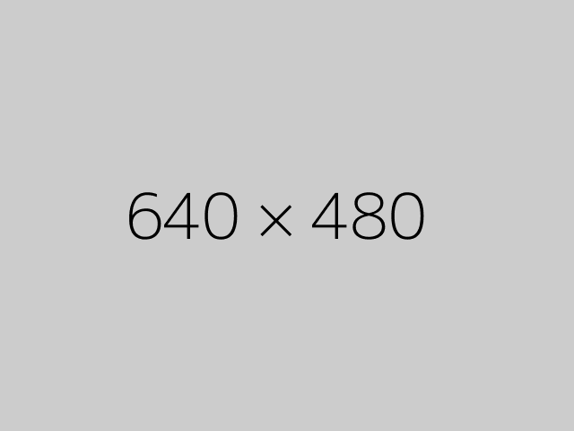

  <!-- You can use Vue components inside markdown -->
  <carbon-pen-fountain class="text-4xl -mb-6 m-auto" />
  <h3>Blog</h3>

<main class="max-w-5xl mx-auto pb-10 pt-10">
  

    

      

        

        <!-- first post -->
          

              
              <h2 class="text-gray-900 font-serif text-3xl my-5 font-thin"><a href="">Blog Post Title</a></h2>
              By Jisu. 2021-03-14
              
Far far away, behind the word mountains, far from the countries Vokalia and Consonantia, there live the blind texts. Separated they live in Bookmarksgrove right at the coast...

              <a href="./article-details.html" class="readmore">Read More...</a>
          

        

      

    

  

</main>
